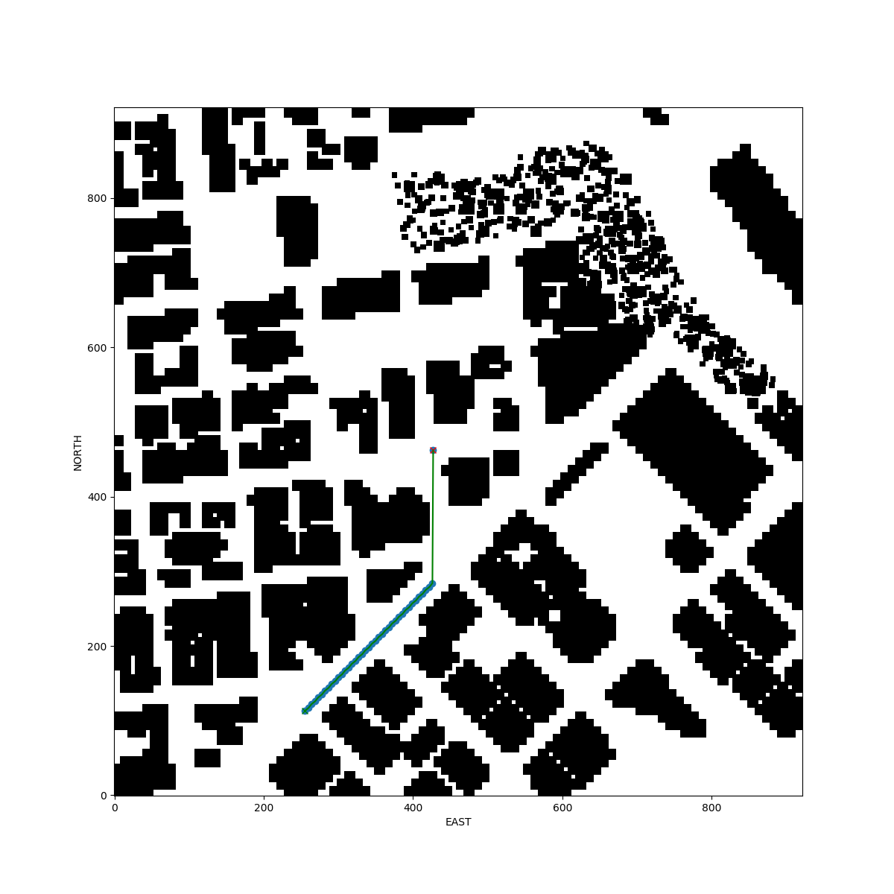
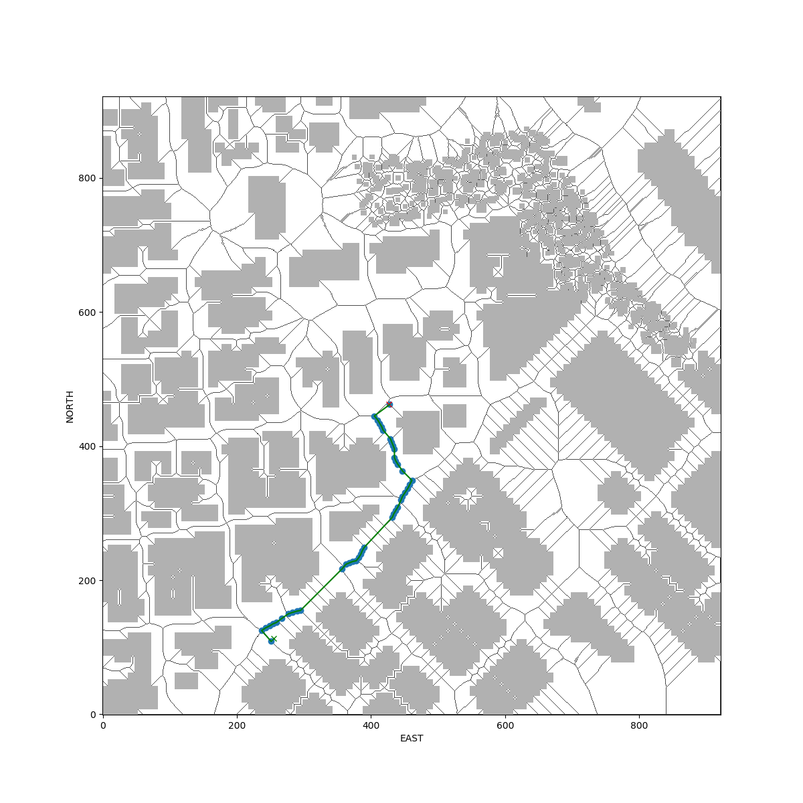
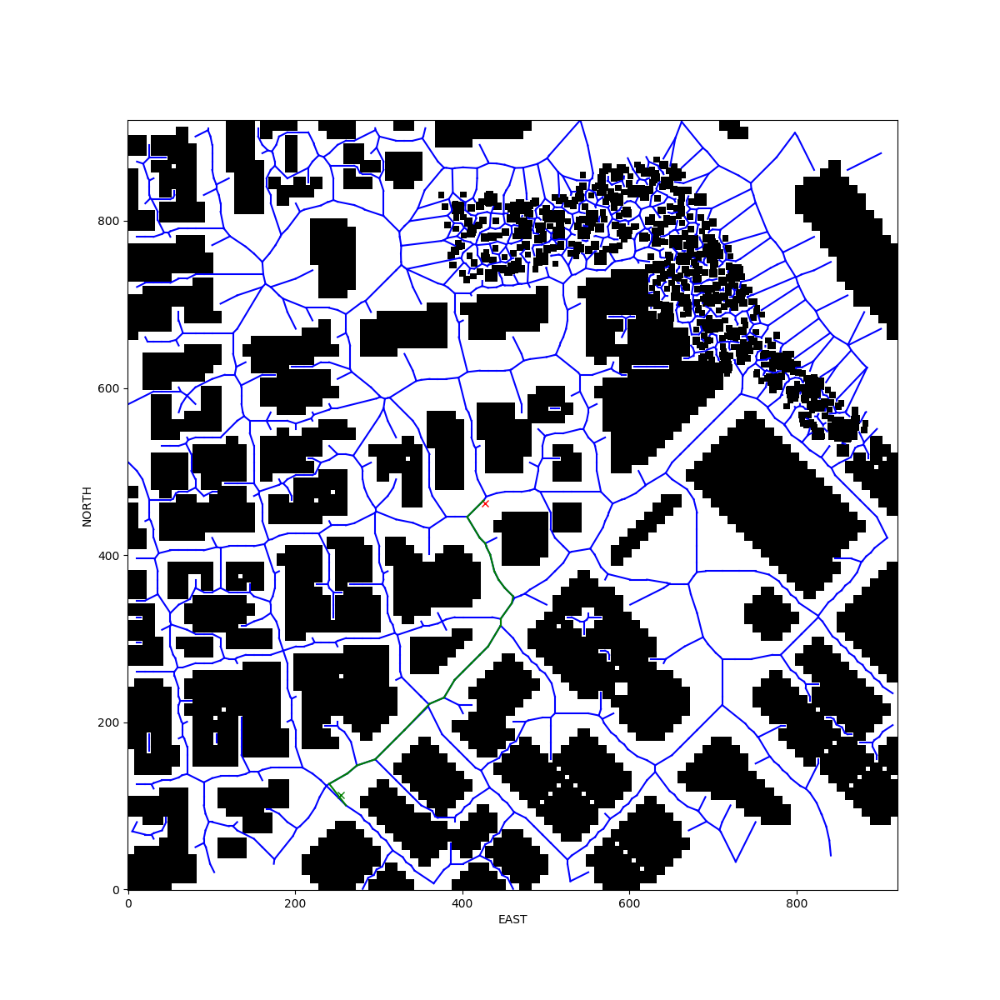

## Project: 3D Motion Planning


---

# Required Steps for a Passing Submission:
1. Load the 2.5D map in the colliders.csv file describing the environment.
2. Discretize the environment into a grid or graph representation.
3. Define the start and goal locations.
4. Perform a search using A* or other search algorithm.
5. Use a collinearity test or ray tracing method (like Bresenham) to remove unnecessary waypoints.
6. Return waypoints in local ECEF coordinates (format for `self.all_waypoints` is [N, E, altitude, heading], where the drone’s start location corresponds to [0, 0, 0, 0].
7. Write it up.
8. Congratulations!  Your Done!

## [Rubric](https://review.udacity.com/#!/rubrics/1534/view) Points
### Here I will consider the rubric points individually and describe how I addressed each point in my implementation.  

---
### Writeup / README

#### 1. Provide a Writeup / README that includes all the rubric points and how you addressed each one.  You can submit your writeup as markdown or pdf.  

You're reading it!

### Explain the Starter Code

#### 1. Explain the functionality of what's provided in `motion_planning.py` and `planning_utils.py`
These scripts contain a basic planning implementation that includes implementation of few alghoritms: simple search, search with skeleton and search with graphs.

Additionally I split other functionality to different files and added changes to first line for home position in csv file.

Also, reused smooth implementation of flying to way points from my previous project.

#### 2. How to run
- install networkx (2.1)
- run emulator
- activate environment
- get help (all additional parameters have their default values)
``` shell
python motion_planning.py --help
```
- run command (example below)
``` shell
python motion_planning.py --alg 0
```

#### 3. Images and plots

### Simple alg



### Skeleton alg



### Graphs alg



### Implementing Your Path Planning Algorithm

#### 1. Set your global home position
Everything in code with additional improvements. 

Shortly:
- get first line with coords
- get data with obstacles 
- also saving initial global home (because of some simulator problem with coords)
- then takeoff to max altitude at map (with some correction)
- then go to home position
- then go to default altitude
- then start planning

#### 2. Set your current local position
#### 3. Set grid start position from local position
#### 4. Set grid goal position from geodetic coords
Everything in code with additional improvements. 

Was missing some simple and easy ways to use API - for example set_home_position should not call a fly - it just need to change internal coords - and then we can simply build a path and fly in usual way without spending a lot of time for different checks.

Absence of basic data structures (classes or at least named tuples) for coords, and a lot of conversions and different data types (Python tuple/list and Numpy structures) makes code hard to understand (also debugging is very hard).

Also simulator doesn't provide data values for some simulator plots (or README how to use them for easy understanding). It's hard to map simulator data to app data because of many layers and geodesic mappings.

Additionally we don't have a "real" non-changeble global home or some hard point in simulator to rely on it without closing and starting simulator - maybe better to have some point at start hardcoded - and don't change the global home after arriving - you can check it when will run script once and then after completion of work try to re-run script without closing simulator. 

Examples of such situation below (global homes are different, global positions too):
``` shell
takeoff global home: [-122.39745   37.79248    0.     ], position: [-122.3974484   37.7924786    0.204    ], local position: [-0.14762771  0.14007021 -0.20408729]
takeoff global home: [-122.3976364   37.7938003    0.       ], position: [-1.22399577e+02  3.77906561e+01  8.20000000e-02], local position: [-3.49358887e+02 -1.72497894e+02 -8.24080855e-02]
```

Shortly:
- saving initial global home (because of some simulator problem with coords or some unusual mapping of data from csv to simulator) - still cannot understand API - maybe because of a lot of layers (simulator, Python, etc.) - its hard to explain - but it works
- mapping start and goal lat/lon with helpers to grid north/east
- getting points at grids for n/e start and goal point
- getting path
- pruning waypoints
- send to simulator to understand is everything correct 
- before flying to waypoint convert it with additional method from saved initial global and current global home to correct waypoint
- fly to corrected waypoint

#### 5. Modify A* to include diagonal motion (or replace A* altogether)
Modified - explanations in some article - http://theory.stanford.edu/~amitp/GameProgramming/Heuristics.html 
Also, reused all 3 algs to check work and understand how these algs are working

#### 6. Cull waypoints 
I implemented very simple algorithm for pruning way points (it's better than default from lessons) in **prune_waypoints** function in **path_helpers.py**. 
It seems that it works very well. 
Briefly:
- remove extra points from straight line 
- then apply some basic math operations for coords to detect closest points and remove them to minimize deviations in path - not optimal but for lessons it can work 

It can be highly improved with applying different math and geodesic approaches.


### Execute the flight
#### 1. Does it work?
It works!

### Double check that you've met specifications for each of the [rubric](https://review.udacity.com/#!/rubrics/1534/view) points.
  
# Extra Challenges: Real World Planning

I added real-world technic to get a home location (usual practice of pilots at war). 
First we take max altitude, then we go to home position, then safely take default altitude and then plan and fly.
Also reused 3 different ways to plan a way and have in mind a improved version of algorithm for pruning of waypoints 
